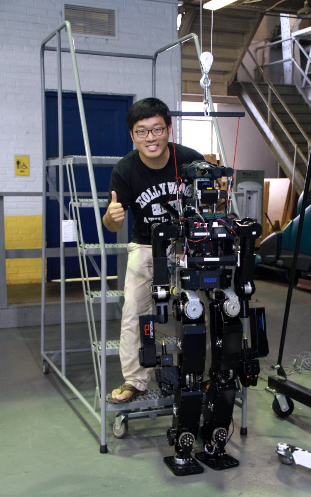

# Biography

I obtained my PhD at Purdue University in Electrical & Computer Engineering and in May 2016. During my PhD years, I worked as Research Assistant at [Assistive Robotics Technology Lab (ART Lab)](https://engineering.purdue.edu/artlab) directed by Prof. C. S. George Lee. In 2012-2013, I was the Control Lead for ladder climbing task in DRC-Hubo team for DARPA Robotics Challenge (DRC) Trials. My research interests are whole-body motion control of humanoid robots and coordinated dual-arm motion control for various manipulation tasks. I graduated from Kwangwoon University in 2009 with Summa Cum Laude (1st/109) for Bachelor’s degree in Electronic Engineering.

- Email: a n d y p a r k . p u r d u e [a] g m a i l . c o m
- [Researchgate](https://www.researchgate.net/profile/Hyungju_Andy_Park)
- [Youtube channel](http://www.youtube.com/c/Robodreamer)
- [Google Scholar](https://scholar.google.com/citations?hl=en&user=29mKTmQAAAAJ)

For more information, please check out some of [my publications](https://scholar.google.com/citations?hl=en&user=29mKTmQAAAAJ) or download [my resume](https://www.dropbox.com/s/pboxmcvhoohlb5a/andypark_resume_august_2022.pdf?dl=0). 