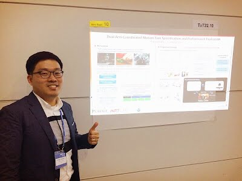
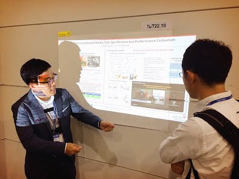
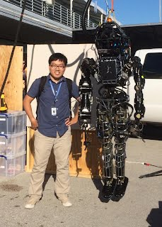

# Photo Gallery

**Oct 2016**. Some pictures taken by my friend during my talks at IROS2016
<!-- 

 -->

  
  

**Nov 2015**. I was invited to give a talk in a robotics seminar class and it was a great time! The title of the talk was "Coordinated Motion Control for Assistive Robots."

  
  

**May 2015**. Nice pictures taken by my friend during my talks at ICRA2015

**Sep 2014**. We gave a demo of Hubo robot during the dedication ceremony of Wang Hall building for ECE dept.

**Dec 2013**. I participated in DRC-Trials held in Miami, FL.

  
  

**Nov 2013**. A picture taken after passing my preliminary exam.

**Aug 2013**. I got married to my beautiful wife, Keru Chen. Yay!

**July 2013**. During DRC-Bootcamp at Drexel University

**May 2013**. A nice picture with my good friends and Dr. Ruzena Bajcsy during ICRA2013 in Karlsruhe, Germany

