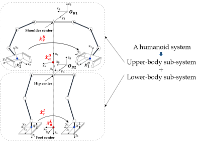
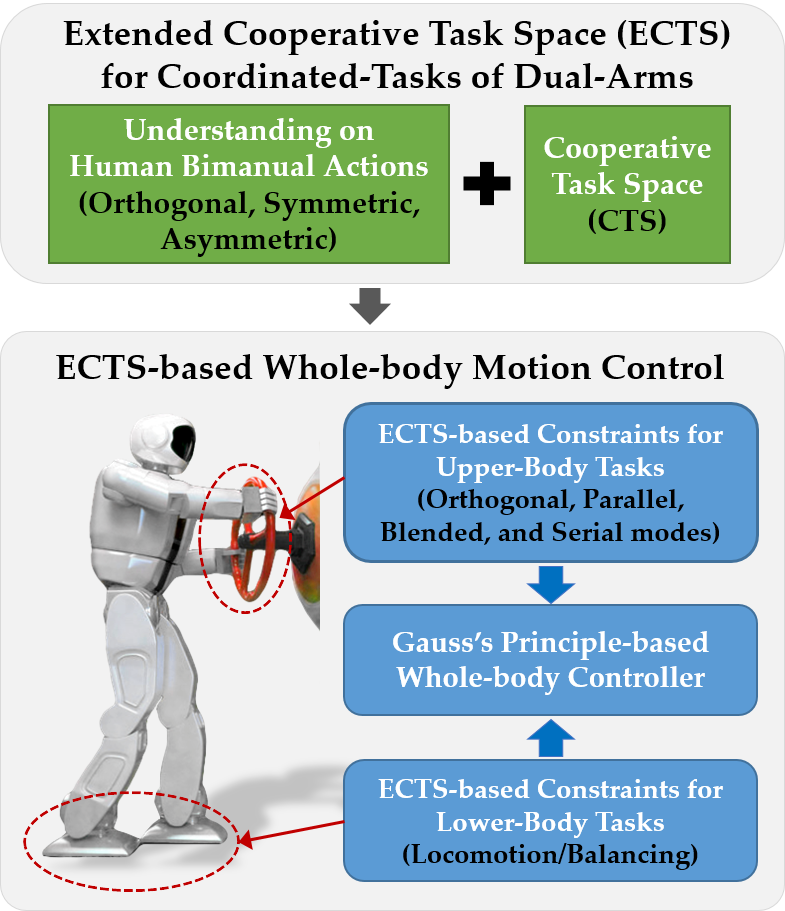
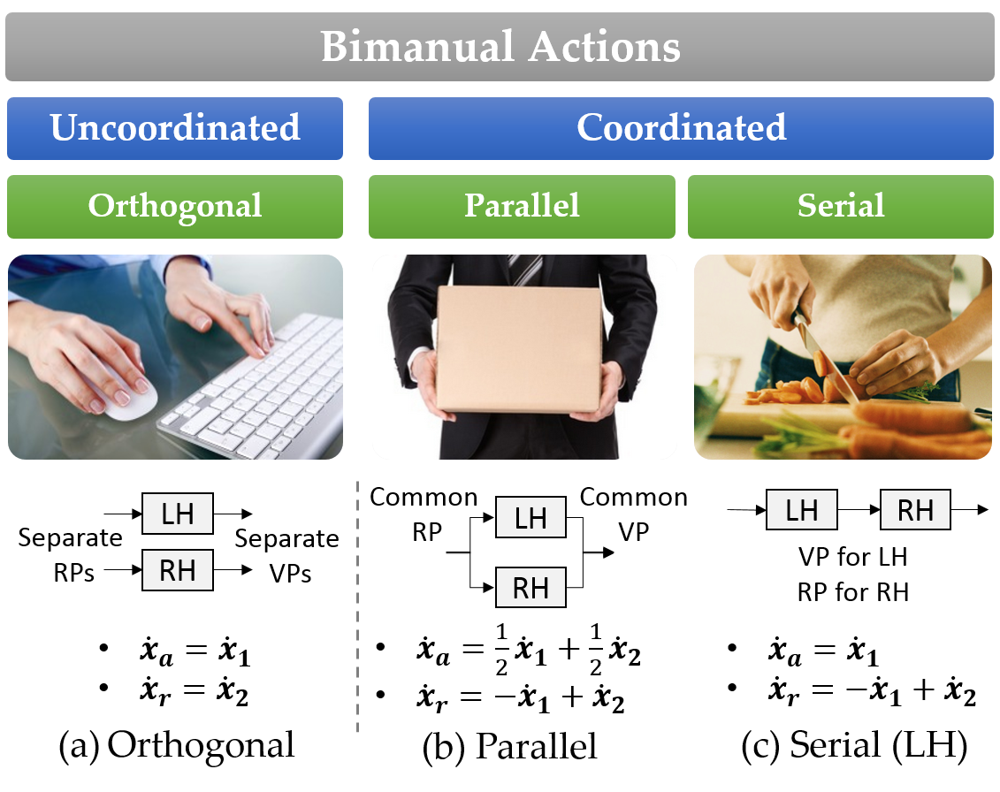
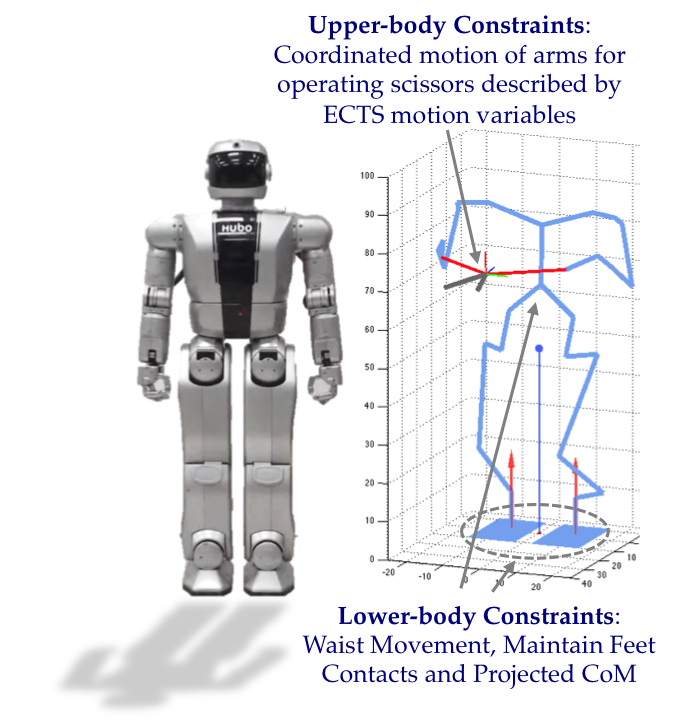
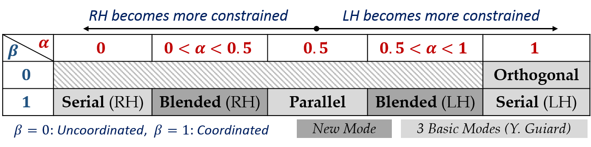
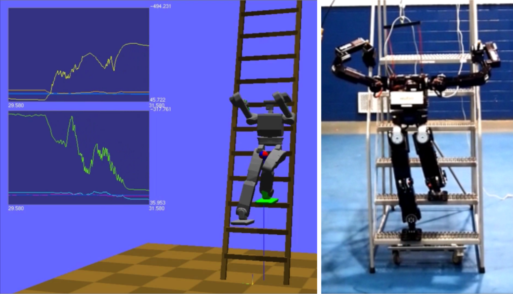
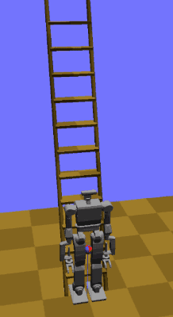
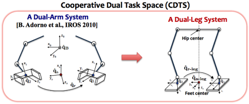
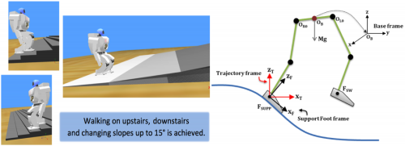
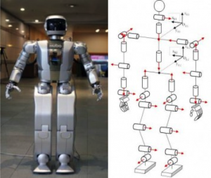

# Extended-Cooperative-Task Space-based Whole-body Control for Humanoid Robots

**Objectives:**

A humanoid robot consists of two bimanual subsystems: upper-body and lower-body subsystems. We show how the manipulation tasks and biped locomotion tasks on both subsystems can be more intuitively and efficiently described using the ECTS representation. A whole-body motion controller is formulated based on Gauss's least control principle as a quadratic programming. Along with the constraints on the upper-body and lower-body constraints in terms of the ECTS representation, the actuation limits along with friction cone constraints can be also incorporated. The proposed framework has been verified on Hubo II+ robot model in V-REP simulation environment. 

  
  

**Publications:**

**"Extended-Cooperative-Task-Space-based Whole-body Control for Humanoid Robots"** H. Andy Park and C. S. George Lee, To be submitted as a Journal paper in 2015.

**Videos:**

    <iframe width="400" height="315" src="https://www.youtube.com/embed/QfVodmQB2vY" title="YouTube video player" frameborder="0" allow="accelerometer; autoplay; clipboard-write; encrypted-media; gyroscope; picture-in-picture; web-share" allowfullscreen></iframe>
    <iframe width="400" height="315" src="https://www.youtube.com/embed/ITUQ0vGUdsc" title="YouTube video player" frameborder="0" allow="accelerometer; autoplay; clipboard-write; encrypted-media; gyroscope; picture-in-picture; web-share" allowfullscreen></iframe>

# Extended-Cooperative-Task Space for Bimanual Manipulation Tasks on Humanoid Robots

**Objectives:**

Using individual arm motions for describing various types of bimanual manipulation tasks, which consist of coordinated and uncoordinated movements, gives heavy burden on the operator for initial definition of a task as well as adapting the task for similar situations. Also, it often requires switching among different exiting representations depending on the type of the coordination required during the task. Thus, for a unified and more intuitive description of different types of coordinated motions in dual-arm manipulation tasks, we have extended the existing Cooperative-Task-Space representation (CTS) with two additional coefficients. Our proposed ECTS representation can enable the operator to more intuitively specify a bimanual manipulation task in terms of four coordination modes in a higher level description. Also, once the task is specified, without changing the main task specification, it can be easily adapted to similar situations. After the manipulation tasks are specified in terms of the ECTS representation as a constraint on the upper-body, for whole-body joint control purpose, we have formulated our whole-body motion controller with constraints based on Gauss’s principle of least constraint.

  
  

**Publications:**

**"Extended-Cooperative-Task-Space for Manipulation Tasks of Humanoid Robots"** H. Andy Park and C. S. George Lee, In proceedings of IEEE Conf. on on Robotics and Automation (ICRA 2015), May 2015

**Videos:**

    <iframe width="400" height="315" src="https://www.youtube.com/embed/RwsNc6NNePo" title="YouTube video player" frameborder="0" allow="accelerometer; autoplay; clipboard-write; encrypted-media; gyroscope; picture-in-picture; web-share" allowfullscreen></iframe>
    <iframe width="400" height="315" src="https://www.youtube.com/embed/jXnpzumF94I" title="YouTube video player" frameborder="0" allow="accelerometer; autoplay; clipboard-write; encrypted-media; gyroscope; picture-in-picture; web-share" allowfullscreen></iframe>

# Ladder Climbing Motion Generation & Control for Humanoid Robots

**Objectives:**

In this project, we have developed a framework on ladder-climbing control for humanoid robots. In collaboration with Indiana University, we participated in DRC-Hubo team (Track A) at DRC trial (Dec 2013 , Miami) funded by DARPA. The ladder-climbing control was proposed to model after stair-climbing minimizing the use of gripping force for climbing allowing us to use existing humanoid robots to perform ladder climbing tasks. Indiana University developed motion planning framework & software that can handle coliision avoidance better and Purdue developed algorithms and dynamics computations and control based on whole-body model of humanoid robots. 

  
  

**Publications:**

1. **"Motion Planning of Ladder Climbing for Humanoid Robots"** Y. Zhang, J. Luo, K. Hauser, R. Ellenberg, P. Oh, H. A. Park, M. Paldhe, and C.S.G. Lee, In proceedings of IEEE Conf. on Technologies for Practical Robot Applications (TePRA), April 2013

2. **"Robust ladder-climbing with a humanoid robot with application to the DARPA Robotics Challenge"** Jingru Luo, Yajia Zhang, Kris Hauser, H. Andy Park, Manas Paldhe, C. S. George Lee, Michael Grey, Mike Stilman, Jun Ho Oh, Jungho Lee, Inhyeok Kim, and Paul Oh, To be presented to IEEE Conf. on Robotics and Automation (ICRA 2014), May 2014

**Videos:**

<iframe width="560" height="315" src="https://www.youtube.com/embed/kb03DDH-TSc" title="YouTube video player" frameborder="0" allow="accelerometer; autoplay; clipboard-write; encrypted-media; gyroscope; picture-in-picture; web-share" allowfullscreen></iframe>

# Whole-body Balancing for Humanoid Robots

**Objectives:**

The goal of this project was to develop a general framework that enables us to generate a library of balanced whole-body motions by merging upper-body motions transferred from human with the lower-body motions generated by existing walking pattern planners. From our observation on human movements where balancing is achieved by coordinated-leg-movements, we have applied cooperative-dual-task-space representation used for coordinated motion tasks of two arm systems to describe and control the coordination between the legs. This representation gave us a nice decoupling between variables regarding feet constraints and waist position, allowing us adjust the balance only maintaining the feet constraints. The proposed method enabled us to achieve balance in a unified manner for static and dynamic lower-body movements which have been handled very differently in other methods. 

**Publications:**

**"Cooperative-Dual-Task-Space-based Whole-body Motion Balancing for Humanoid Robots"** H. Andy Park and C.S. George Lee In proceedings of IEEE Conf. on on Robotics and Automation (ICRA 2013), May 2013

**Videos:**

<iframe width="560" height="315" src="https://www.youtube.com/embed/zHY2IKbsThQ" title="YouTube video player" frameborder="0" allow="accelerometer; autoplay; clipboard-write; encrypted-media; gyroscope; picture-in-picture; web-share" allowfullscreen></iframe>

# Uneven Walking Pattern Generation for Humanoid Robots

**Objectives:**

In this project, our goal was to generalize an existing walking pattern planners for uneven terrain environment such as slopes and stairs. In a modification to Convolution-Sum-based walking pattern generator, we removed jerkiness of generated Center-of-Mass (CoM) motion by using a low-pass-filter, and generated an additional ankle joint movement and vertical CoM movement adapting to the uneven terrain environment. The proposed method was successfully validated for Hoap-2 robot in Webots.

**Publications:**

**"Convolution-Sum-Based Generation of Walking Patterns for Uneven Terrains"** H. Andy Park, Muhammad A. Ali and C.S. George Lee In proceedings of IEEE-RAS Conf. on Humanoid Robots (Humanoid 2010), Dec. 2010

# Closed-Form Inverse Kinematic Joint Position Solutions for Humanoid Robots

**Objectives:**

In this project, we aimed to obtain closed-form joint position solutions for most existing humanoid platforms -- Hubo KHR-4, ASIMO, HRP-2, and HOAP-2. We have developed a novel "Reversed-Decoupling" approach that enables us to solve for closed-form position solutions in upper/lower limbs with 6-DoFs at most. 

**Publications:** 
1. **“Closed-Form Inverse Kinematic Joint Solution for Humanoid Robots”** H. Andy Park, Muhammad A. Ali and C.S. George Lee The International Journal of Humanoid Robotics, Vol. 9, No. 3 (2012)

2. **“Closed-Form Inverse Kinematic Joint Solution for Humanoid Robots”** Muhammad A. Ali, H. Andy Park and C.S. George Lee In proceedings of IEEE/RSJ Intl. Conf. on Intelligent Robots and Systems (IROS), October 2010